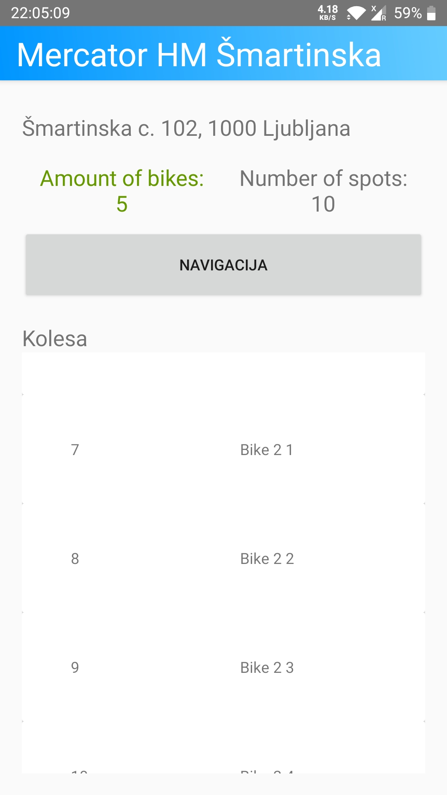

# Funkcionalna specifikacija za aplikacijo "MBajk"

## 1. Uvod

Za seminarsko nalogo pri predmetu Elektronsko in mobilno poslovanje sem izbral temo "Mobilna aplikacija za izposojo koles". Ime aplikacije je "MBajk".
V aplikaciji imajo uporabniki možnost izposoje koles, ki so raztrosena po mestu na postajah.

## 2. Funkcionalnosti aplikacije

Delovala bo na operacijskem sistemu Android Lollipop. Podatki se bodo shranjevali v SQLite podatkovni bazi.

### 2.1. Glavni zaslon

Ko bo uporabnik odprl aplikacijo, se mu bodo prikazale tri funkcije/gumba:

- izposodi kolo
- vrni kolo
- preveri postaje
  Za funkciji izposodi in vrni kolo mora uporabnik dovoliti vklop in branje kamere, saj bo aplikacija preverjala QR kodo, ki jo bo uporabnik usmeril na telefon. Prav tako mora vpisati svojo telefonsko številko.

### 2.2. Izposodi kolo

V primeru, da uporabnik izbere funkcijo "Izposodi", uporabnika najprej vprašamo, če dovoli vklop in branje kamere, nato jo vključimo (To privolitev si tudi zapomnimo). Nato pa mora uporabnik oditi do parkirišča na postaji, kjer je QR koda. V to kodo mora usmeriti telefon. Če je kolo tam, mu bo aplikacija prikazala, da je kolo uspešno izposojeno. Če kolesa ni tam, pa bo aplikacija prikazala, da ni na voljo. Tako si bo uporabnik lahko izposodil kolo. Prav tako pa aplikacija preverja, če si uporabnik ni že izposodil kolesa.

### 2.3. Vrni kolo

Podobno kot pri funkciji "Izposodi", le da bo uporabnik vračal kolo, ne pa ga izposojal. V primeru, da bo kolesa prej ni na postaji, bo aplikacija prikazala, da je kolo vrnjeno. V primeru, da je parkirišče zasedeno, pa bo aplikacija prikazala, da kolesa ni na postaji. Prav tako pa aplikacija preverja, če uporabnik sploh ima izposojeno kolo.

### 2.4. Preveri postaje

V primeru, da uporabnik izbere funkcijo "Preveri postaje", se mu prikaže seznam vseh postaj. Vpraša uporabnika, da pusti brati lokacijo. Postaje ze izpišejo urejeno po oddaljenosti lokacije uporabnika do postaje. Uporabnik lahko izbere, katero postajo želi preveriti. Ko izbere postajo, se mu pokažejo podatki:

- ime postaje
- naslov postaje
- število koles na postaji
- število parkirnih mest na postaji
- kolesa, ki so na postaji
- gumb, ki pa uporabnika preusmeri na zemljevid in mu poda navodila, kako priti do postaje

Prav tako lahko na vsakem seznamu uporabnik potegne s prstom navzdol, da se osveži seznam. V primeru, da si nekdo izposodi kolo, bo na seznamu postaje, kjer je bilo kolo izposojeno izginilo. Obratno pa se bo zgodilo, če bo kolo vrnjeno.

## 3. Funkcionalna specifikacija

### 3.1. Koda aplikacije

Program se začne izvajati v **MainActivity.kt**:
Ta aktivnost nastavi vsebino na main_activity.xml. Nato pa vsakemu gumbu na tem oknu nastavi "onClickEventListener", ki ga bo poklical, ko bo uporabnik kliknil na gumb. Vsi te gumbi pa na nato pokličejo nove aktivnosti.

Gumb "Preveri lokacije" pokliče aktivnost **StationActivity.kt**:
Ta aktivnosti najprej nastavi vsebino na station_activity.xml. Nato naredi instanco LocationServices razreda, ki ga uporabljam za preverjanje lokacije uporabnika. Uporabnika še vpraša za dovoljenje do GPS, če tega še nima.
Nato zgenerira "RecyclerView", ki bo prikazoval seznam postaj. Po tem definira še ViewModel za postaje, ki služi za dostopanje in shranjevanje podatkov o postajah. Nato pa se prikažejo postaje, ki so na voljo. Nato uporabim ta viewmodel da naredim poizvedbo o postajah. Ko dobim odgovor, se za vsako postajo kliče adapter od RecyclerView, ki zapolni kartice o postajah s podatki in jih naniza na RecyclerView. Prav tako pa adpater še doda "onClickEventListener", ki bo poklical aktivnost **BikeListActivity.kt**, ko bo uporabnik kliknil na postajo. V tem "onClickEventListenerju" se še v intentu shranijo podatki o postaji, ki jih bo uporabila aktivnost **BikeListActivity.kt**.
Izvede se še setup za "refresh" postaj.
Če uporabnik pritisne na postajo, se zažene aktivnost **BikeListActivity.kt**:
Ta aktivnost najprej nastavi vsebino na bike_list_activity.xml. Nato pridobi podatke iz intenta, ki jih je StationActivity.kt prej shranil. Nastavi vse "textViewe" na podatke, ki jih je prejel. Nastavi "onClickEventListener" za gumb "Navigacija", ki kliče Google Maps, da nam pokaže pot do postaje.
Nato se nastavi RecyclerView za kolesa na postaji na podoben način kot pri postajah, le da tu naredimo poizvedbo preko "BikeViewModel.kt" za kolesa s id postaje. Nastavi se še refresh za kolesa.

Sedaj se vrnemo na aktivnost **MainActivity.kt**. Če uporabnik pritisne na gumb "Izposodi" ali "Vrni", se zažene aktivnost **RequestActivity.kt**, ki služi za izposojo in vračanje koles:
Ta aktivnost najprej nastavi vsebino na request_activity.xml. Nato inicializira ViewModel za vse tabele v bazi (stationViewModel, bikeViewModel, userViewModel), ki jih bomo potrebovali. Nato kliče fragment **ScanQRFragment.kt**:
Najprej dobi instanco z ProcessCameraProvider. Nato pošlje prošnjo za dostop do kamere. Če je prošnja že odobrena, zažene kamero, sicer prosi za prošnjo in nato odpre kamero.
Ko se odpre kamera, se na cameraProviderFuture nastavi listener, ki se zažene ko ContextCompat dobi glavno nit. V tem listenerju se nato kliče bindCameraPreview, ki nastavi kamero na previewView, katerega nato uporabnik vidi. prav tako pa se v tej funkciji inicializira ImageAnalyzer za QR kodo. Nastavijo se listenerji, ko ImageAnalyzer QR kodo najde in ko je ne. Če jo najde se na **RequestActivitiju** kliče funkcija bikeRequest. Ta funkcija najprej preveri, če je uporabnik skeniral pravo QR kodo, in ni neka tretja. Nato pa se pošlje poizvedba preko bikeViewModela, ki poišče kolesa z danim stationId (ključ postaje) in spotIndex (številka parkirišča na postaji). Nato pa se na podlagi uporabnikove izbire (izposoja ali vračilo) izvede ustrezna poizvedba.
Če je uporabnik izbral izposojo, kolesu stationId in spotIndex nastavimo na -1, userju v podatkovni bazi pa nastavimo bikeId na kluč kolesa.
Obratno, če je uporabnik izbral vračilo, kolesu stationId in spotIndex nastavimo na stationId in spotIndex postaje, userju v podatkovni bazi pa nastavimo bikeId na -1.
V primeru napake se uporabniku prikaže, do katere je prišlo.

## 3.2. Dostop do podatkov

Za dostop podatkov ima aplikacija množico razredov. Za vsako tabelo so svoji razredi, ki služijo za dostop do podatkov. Pri vseh tabelah je princip poizvedbe isti, zato bom opisal le enega.

V razredu **Bike.kt** je definirana sama tabela. Najprej definiramo entiteto in ji damo neko ime. Nato pa definiramo data class, ki služi le hranjenju podatkov. Tam definiramo vse stolpce tabele.
Ko želimo dostopati do podatkov, to počnemo preko razreda ViewModel. V tem primeru se ta imenuje BikeViewModel.kt. Ta služi le za interakcijo med programerjem in podatkovno bazo. Je mejnik med več nitnostjo. Vsebuje več spremenljivk, ki so v večini tako imenovani **LiveData** ali **MutableLiveData**. Te služijo kot nek "placeholder" za podatke. Mi nato na teh spremenljivkah poslušamo, ali je poizvedba že opravljena ali še ne. Nato pa vsebuje tudi funkcije za poizvedbe. Te funkcije prejmejo argumente od programerja in zaženejo Coroutine, ki nato kličejo ustrezno funkcijo v repozitoriju.
V tem primeru se ta razred imenuje **BikeRepository.kt**:
Ta razred služi kot vmesnik med samim SQL-om in kodo v kotlinu. Vsebuje funkcije, ki vsebujejo ključno besedo suspend. Ta beseda pomeni, da se funkcija zažene v Coroutini in se lahko ustavi in nato ponovno nadaljuje. Tako dosežemo večnitnost pri dostopu do podatkovne baze. Nato pa te funkcije kličejo ustrezne funkcije v Dao interfacu. V tem primeru se ta imenuje **BikeDao.kt**:
Tu pa se nato izvede SQL stavek, ki pa nato vrnjeno vrne nazaj gor po verigi. Ko se vrne nazaj, se na spremenljivki, ki smo jo poslušali, nastavi podatek, ki ga je vrnil SQL stavek.

## 3.3. Uporabniški vmesnik

